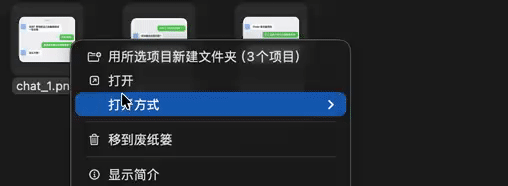
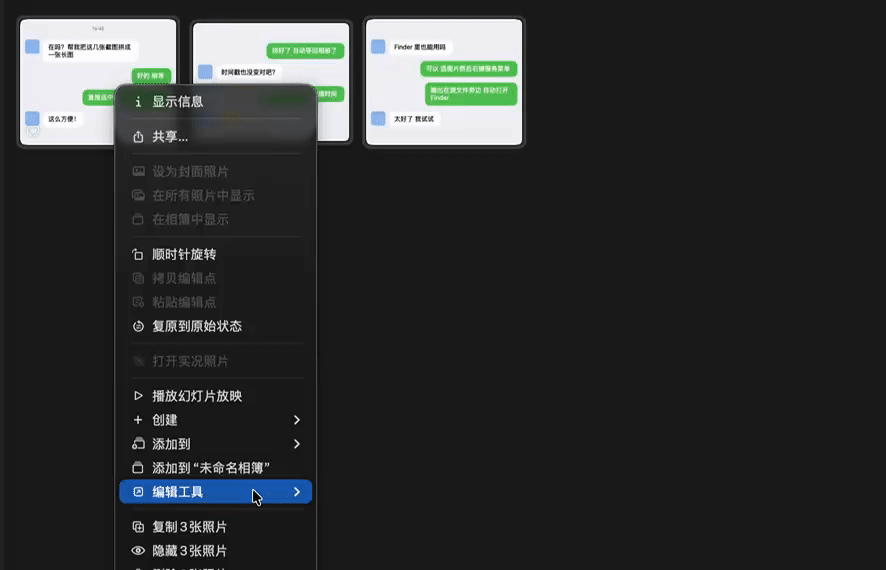

<p align="center">
  
</p>

<h1 align="center">Stitch Images</h1>

<p align="center">A lightweight macOS utility that stitches multiple images vertically into one long image.</p>

<p align="center">
  <b>English</b> · <a href="README_zh.md">中文</a>
</p>

<div align="center">
<table>
  <tr>
    <td align="center"><strong>Finder</strong></td>
    <td align="center"><strong>Photos</strong></td>
  </tr>
  <tr>
    <td></td>
    <td></td>
  </tr>
</table>
</div>

## Highlights

- **Smart output routing** — images from Photos are imported back to Photos; images from Finder / CLI are saved next to the source files and revealed in Finder
- **Photos "Edit With"** — appears in the Photos right-click "Edit With" menu — select and stitch
- **Finder multi-entry** — select images in Finder, then use "Open With → Stitch Images" or right-click "Services → Stitch Images"
- **Timestamp inheritance** — the stitched image inherits the capture date of the first input (EXIF / TIFF / PNG / file attributes), so it won't jump to the latest in Photos
- **Auto-merge batches** — when Photos splits a multi-select into several `open` events, the app auto-merges them within a short window
- **HEIC-first output** — prefers HEIC (smaller size); falls back to JPEG when the system doesn't support it

## Requirements

- macOS 13.0 (Ventura) or later

## Project Structure

| Path | Description |
| --- | --- |
| `Sources/` | AppKit app source code |
| `Resources/Info.plist` | Bundle, document types and Finder Service declarations |
| `Resources/*.lproj/` | Localized strings (English & Simplified Chinese) |
| `scripts/build.sh` | Compile, package, install to `~/Applications/` |
| `scripts/smoke_test.sh` | Generate sample images and run a smoke test (no Photos import) |

## Build

```bash
./scripts/build.sh
```

The app will be installed to `~/Applications/`.

## Usage

1. In Photos, select multiple images, right-click → "Edit With" → "Stitch Images"
2. If Photos only passes 1 image, use Finder: select images → right-click → "Services → Stitch Images"
3. On first import back to Photos, the system will prompt for photo access — grant it

You can also use the command line:

```bash
open -a ~/Applications/Stitch\ Images.app photo1.jpg photo2.png photo3.heic
```

## Testing

```bash
./scripts/smoke_test.sh
```

This test does not import into Photos. It saves output to a temp directory and prints the file path and pixel dimensions.
